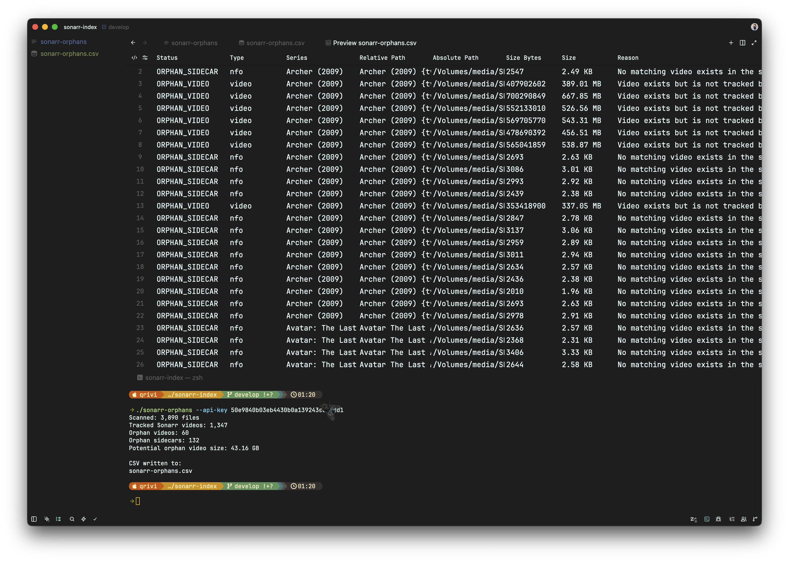

# `sonarr-orphans`

There's a lot going on in my TV library: Sonarr tracks and upgrades episodes, Tdarr transcodes and replaces videos, and Bazarr adds missing subtitles. While checking my Tdarr review queue, I noticed videos whose filenames suggested they didn't meet my quality profiles. A closer look at the filesystem revealed duplicate videos of different qualities and subtitles left over from replaced files.

I suspect these are edge cases: Tdarr may finish transcoding a file after Sonarr has replaced it and then put the old version back, or Bazarr may leave subtitles behind when a video is deleted. Either way, these files need manual review and cleanup. This read-only script generates a CSV report to help identify them:

- Scans all files in your TV library
- Lists NFO and SRT files with no matching video file, excluding series and season metadata (`tvshow.nfo` and `season.nfo`)
- Lists video files that are not tracked by Sonarr



Run the offline regression tests with Python's built-in test runner:

```sh
python3 -B -m unittest -v
```

The tests use temporary library folders and mocked Sonarr responses; they do not require an API key or a mounted media share.
